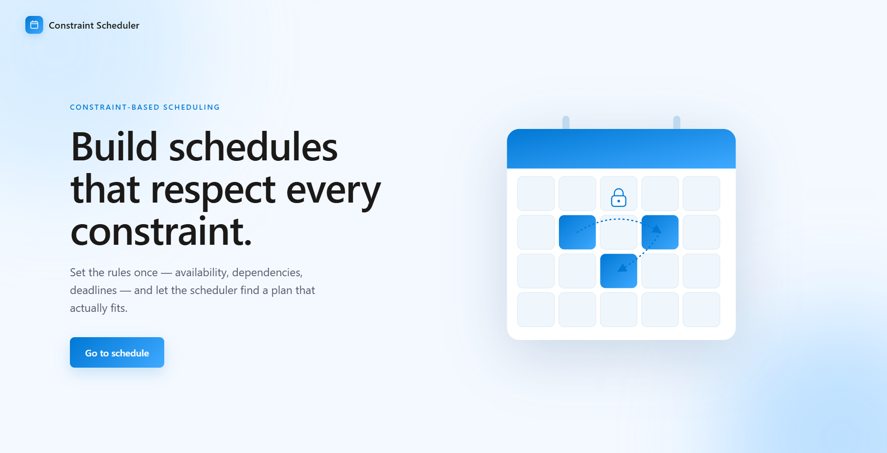
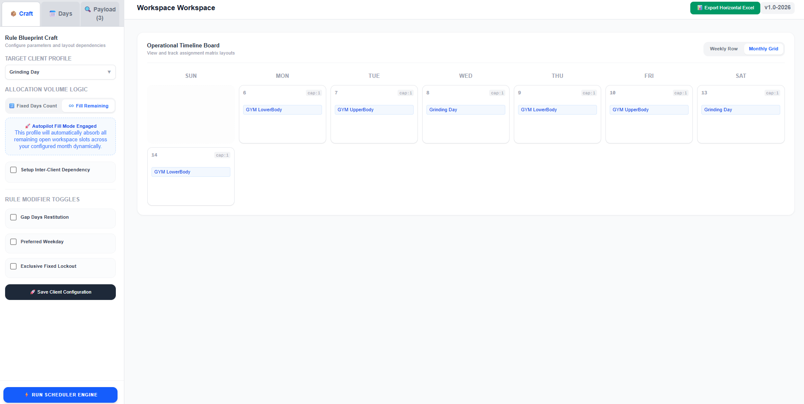
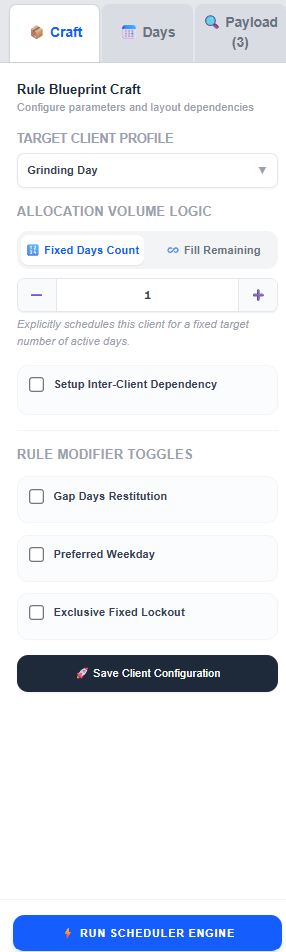
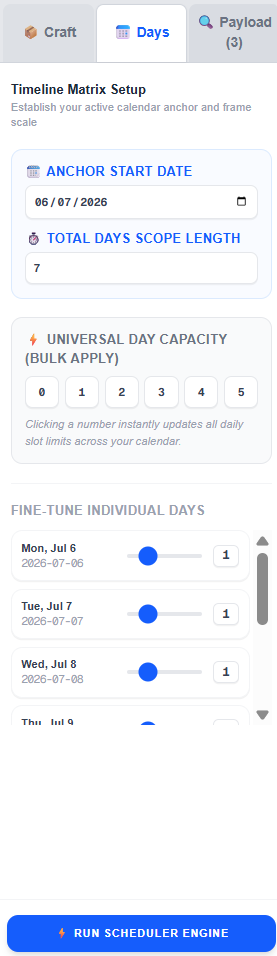
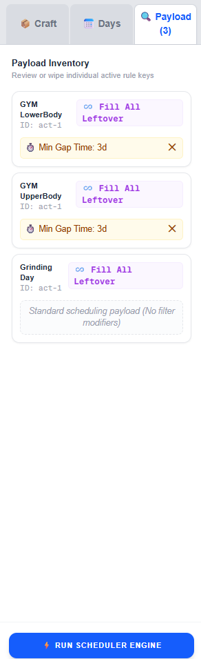

# Constraint Scheduler

> **Live site → [constraint-base-scheduler.vercel.app](https://constraint-base-scheduler.vercel.app/)**

A constraint-based scheduling engine with a visual workspace. Set the rules once — availability, dependencies, gap requirements — and let the engine find a plan that actually fits.

---

## Preview

### Landing Page



### Scheduler Workspace



---

## How It Works

The app is split into three panels accessible from the sidebar tabs: **Craft**, **Days**, and **Payload**.

### Craft — Rule Blueprint

Configure each client profile and their scheduling rules.



- **Target Client Profile** — select which client you're configuring
- **Allocation Volume Logic** — choose between:
  - `Fixed Days Count` — place this client exactly N times
  - `Fill Remaining` — fill all leftover slots automatically (round-robin with other fill clients)
- **Setup Inter-Client Dependency** — make this client land immediately before or after another client
- **Rule Modifier Toggles**:
  - `Gap Days Restitution` — enforce a minimum gap between this client's sessions
  - `Preferred Weekday` — restrict this client to a specific weekday (shareable)
  - `Exclusive Fixed Lockout` — pin to a weekday and lock that day for this client only

---

### Days — Timeline Matrix Setup

Define the scheduling window and capacity per day.



- **Anchor Start Date** — the first date of the schedule
- **Total Days Scope Length** — how many days the schedule spans
- **Universal Day Capacity (Bulk Apply)** — set the same slot limit across all days in one click
- **Fine-Tune Individual Days** — override capacity per day using a slider

---

### Payload — Active Rule Inventory

Review all configured client rules before running the engine.



Each card shows the client name, allocation mode, and any active rule modifiers. Rules can be cleared individually before running.

---

## Running the Engine

Hit **Run Scheduler Engine** at the bottom of the sidebar. The engine resolves all constraints in priority order and fills the Operational Timeline Board with the results.

---

## Engine Capabilities

| Feature                       | Description                                                  |
| ----------------------------- | ------------------------------------------------------------ |
| `daysNeeded`                  | Place a client exactly N times                               |
| `fillRemaining`               | Fill all leftover slots, rotates fairly between fill clients |
| `gapDays`                     | Minimum days between a client's own sessions                 |
| `exclusiveDays`               | Restrict to a list of allowed weekdays                       |
| `preferredDay`                | Must land on one specific weekday, shareable                 |
| `exclusiveFixedDate`          | Must land on one specific weekday, locks the day             |
| `dependsOnClient`             | Must land the day immediately before/after another client    |
| Circular dependency detection | Caught and reported clearly, no crash                        |
| Per-instance failure reasons  | Every unscheduled slot reports exactly why                   |

### Scheduling Priority Order

1. Dependency order resolved first (topological sort)
2. `exclusiveFixedDate` — most constrained
3. `preferredDay`
4. `exclusiveDays` (shorter list = higher priority)
5. `gapDays`
6. `daysNeeded > 1`
7. Unconstrained activities
8. `fillRemaining` — always last, round-robin between fill clients

---

## Output

The engine returns:

- **Assignments** — `{ activityId, clientName, date }` for every placed session
- **Unscheduled** — `{ activity, reason }` for anything that couldn't fit, with a human-readable explanation

Results are displayed on the **Operational Timeline Board** in either Weekly Row or Monthly Grid view, with an **Export Horizontal Excel** option for sharing.

---

## Tech Stack

- **Framework** — Next.js (App Router)
- **Language** — TypeScript
- **Styling** — CSS (styled-jsx)
- **Engine** — Custom constraint-based scheduler (`scheduler-engine.ts`)
- **Rules** — Pluggable rule system (`rules.ts`) — add new constraints without touching the engine

---

## Project Structure

```
├── app/
│   └── page.tsx              # Landing page
│   └── schedule/
│       └── page.tsx          # Scheduler workspace
├── lib/
│   ├── types.ts              # Shared TypeScript interfaces
│   ├── rules.ts              # All scheduling constraints
│   └── scheduler-engine.ts  # Core distribution algorithm
```

---

## Adding a New Rule

1. Open `rules.ts`
2. Write an object matching the `Rule` shape:

```ts
export const myNewRule: Rule = {
  name: "myRule",
  appliesTo: (activity) => !!activity.myField,
  validate: ({ activity, day, state }) => {
    // return { valid: true } or { valid: false, reason: "..." }
  },
};
```

3. Add it to `defaultRules`
4. Done — the engine picks it up automatically

---

_v1.0-2026_
